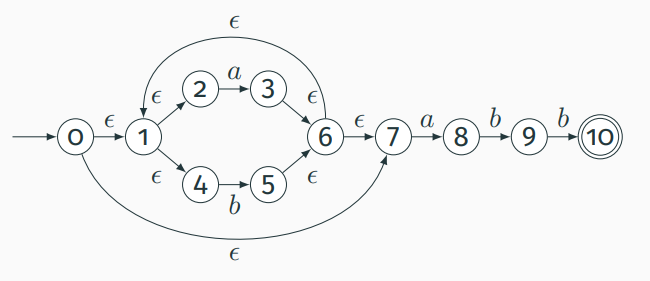

# LearnCompilerWithPython

Simple python examples of how compiler works. Have fun learning compiler with the examples!

## NFA.py

An NFA that accepts (a|b)*abb. Note: The NFA implementation is more trickier than DFA.

## DFA.py

A DFA that accepts (a|b)*abb

## TopDownParser.py

A Top Down Parser for parsing input like \$3+2\*2+7\*3\$ and \$3+2\*(2+7)\*3\$

## LR0_Parser.py

Implementation of LR-parsing algorithm described in the Dragon book Second Edition.

The algorithm description below, grammar and SLR table are all from the Dragon book Second Edition written by Alfred V. Abo, Monica S. Lam , Ravi Sethi and Jeffrey D. Ullman 

